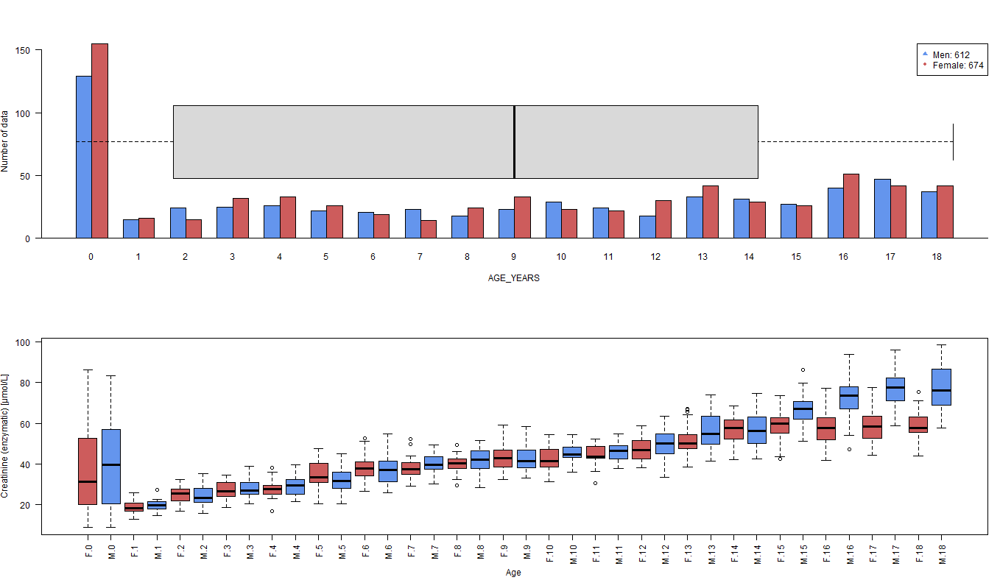
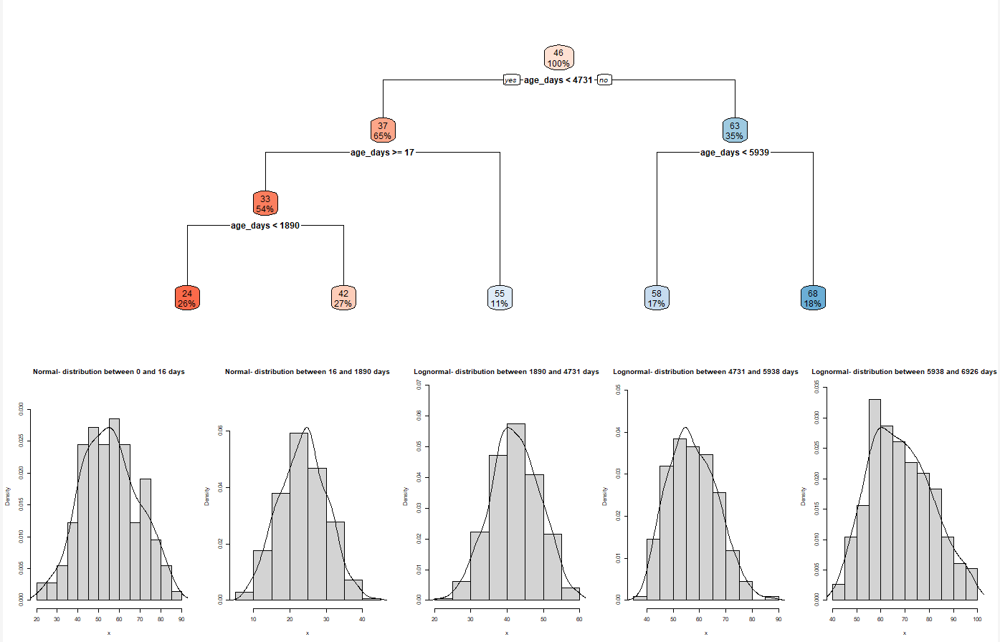

# Age-dependent-Reference-Intervals (AdRI)
[]()
[]()


**Shiny App for calculating Age-dependent Reference Intervals!**

This Shiny App was developed to create **A**ge-**d**ependent **R**eference **I**ntervals (**AdRI**) using different methods ([**LMS**](https://github.com/SandraKla/Age-dependent-Reference-Intervals/wiki/Generalized-additive-models-for-location,-scale-and-shape-(GAMLSS)#lms), [**GAMLSS**](https://github.com/SandraKla/Age-dependent-Reference-Intervals/wiki/Generalized-additive-models-for-location,-scale-and-shape-(GAMLSS)), [**Window-Methods**](https://github.com/SandraKla/Age-dependent-Reference-Intervals/wiki/Window-Methods) and [**Regression**](https://github.com/SandraKla/Age-dependent-Reference-Intervals/wiki/Regression)) (see the [Wiki](https://github.com/SandraKla/Age-dependent-Reference-Intervals/wiki)). 

## Installation

Download the Zip-File from this Shiny App, set your working direction to this path and run:

```bash
# Test if shiny is installed:
if("shiny" %in% rownames(installed.packages())){
  library(shiny)} else{
  install.packages("shiny")}
```

```bash
library(shiny)
runApp("app.R")
```
Or use the function ```runGitHub()``` from the package *shiny*:

```bash
library(shiny)
runGitHub("Age-dependent-Reference-Intervals", "SandraKla")
```

All required packages are downloaded when starting this app or imported if they already exist. For more information about the required packages use the [Wiki](https://github.com/SandraKla/Age-dependent-Reference-Intervals/wiki/Versions).


## Example with the Creatinine data from the CALIPER study

**Overview:**

Dataset with modified Tukey-method coupled to a Decision Tree:

Gender distribution:


**Window-Methods:**

**Decision Tree for age partitioning:**


**Regressions:**


**GAMLSS:**

**Comparison of GAMLSS-models:**


**Residuals from the GAMLSS-models:**


**Make discrete models from the GAMLSS-models:**

