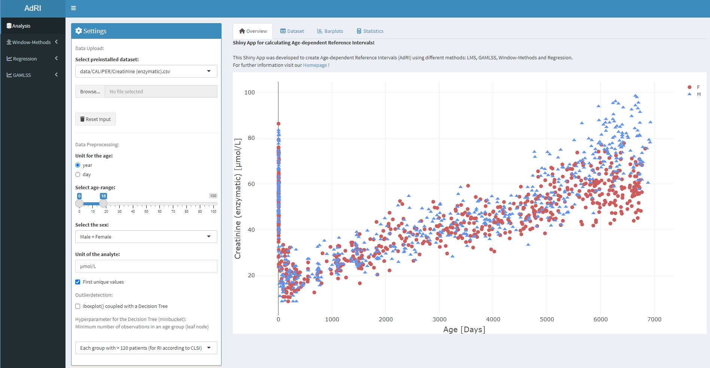

[Home](./index.md) --- [Installation](./install.md) --- [Data](./data.md) --- [Methods](./methods.md) --- [Guide](./guide.md) --- [About](./about.md)

---

The data is loaded with `read.csv2()` and the tables are written with `write.csv2()`. The CSV file has a semicolon as separator. The data must contain the following information: **SEX** ("F" = female, "M" = male), **AGE_DAYS** (age in days), **AGE_YEARS** (age in years), **VALUE** (value of the analyte) and **ANALYTE** (name of the analyte):

```bash
SEX;AGE_DAYS;AGE_YEARS;VALUE;ANALYTE
M;2;0;1;EXAMPLE
F;2;0;2;EXAMPLE
F;3;0;;EXAMPLE
F;3;0;1;EXAMPLE
M;3;0;2;EXAMPLE
```



The data set can be presorted:

* with the **Age Range** in years or in days
* with the **Sex**


* with the use of the **First unique value**. The default is TRUE (double or multiple values of the same patient will not be considered)
* with the **Outlierdetection** with the iboxplot() coupled to a Decision Tree


* **ID** (patient number) is automatic filled with unique numbers (if not specified)  
* **STATION** (station code)- filled with NA (if not specified)
* Delete data with NA in **VALUE** (value of the analyte)

All tables can be saved as CSV and figures as PNG or some as EPS and JPEG. For plotly figures use the menu in the right corner. 
