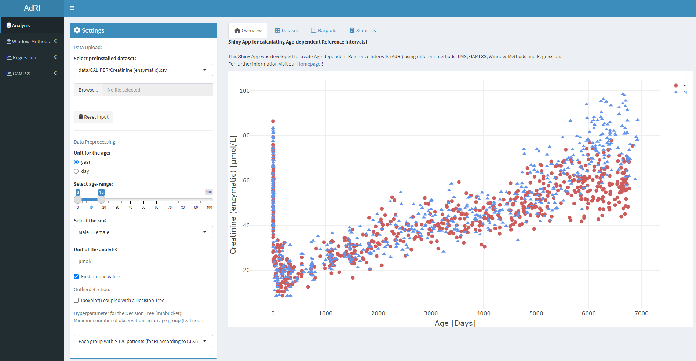

[Home](./index.md) --- [Installation](./install.md) --- [Data](./data.md) --- [Methods](./methods.md) --- [Guide](./guide.md) --- [About](./about.md)

---

This Shiny App was developed to create **A**ge-**d**ependent **R**eference **I**ntervals (**AdRI**) using different methods **LMS**, **GAMLSS**, **Window-Methods** and **Regression**. 

*** **Warning!** This Shiny App has not been enough validated for the basis of a medical diagnosis! There is no warranty for the app and/or the reference intervals! ***

Reference Intervals are established using the central 95% range of measurements, defined by the 2.5th and 97.5th percentiles. The CLSI guideline recommends a minimum sample size of 120. 

The distribution of the data for the **LMS**-Method is selected from the Box-Cox Cole & Green Distribution (`BCCG`), Box-Cox Power Exponential Distribution (`BCPE`) or Box-Cox t-Distribution (`BCT`) and for **GAMLSS** additionally the Normal-Distribution (`NO`) and Log-Normal-Distribution (`LOGNO`). The models are created with the package [gamlss](https://cran.r-project.org/web/packages/gamlss/index.html). The **GAMLSS** Models have different additive terms for smoothing. Currently four **Window-Methods** are available: regular Windows, Windows with age groups from a Decision Tree or given age groups from the Laboratory Information Systems (LIS) and the Sliding Window-Method with different sizes. There are also four types of **Regressions**. The Decision Tree from **rpart** for age-portioning has two hyperparameters `minsplit` and `cp`. `minsplit` stands for _the minimum number of observations that must exist in a node in order for a split to be attempted_ and cp represents a complexity parameter. Sometimes it can make sense to lower the `cp` for increased age dependency and more age groups.

Link to the publication: [A visualization tool for continuous reference intervals based on GAMLSS](https://www.degruyter.com/document/doi/10.1515/labmed-2023-0033/html)
