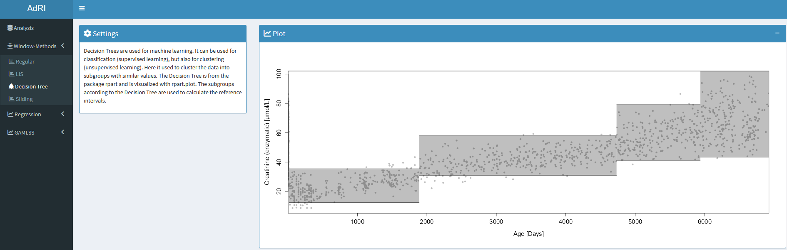

[Home](./index.md) --- [Installation](./install.md) --- [Data](./data.md) --- [Methods](./methods.md) --- [Guide](./guide.md) --- [About](./about.md)

---
1) [GAMLSS](#gamlss)
2) [LMS](#lms)
3) [Window-Methods](#window)
4) [Regression](#regression)
---

## GAMLSS <a name = "gamlss"></a>

Generalized additive models for location, scale and shape (GAMLSS) are distributional regression models, where all the parameters of the assumed distribution for the response can be modeled as additive functions of the explanatory variables. GAMLSS can be created with various distributions and different additive terms for smoothing. They are parametric, in that they require a parametric distribution assumption for the response variable, and semiparametric in the sense that the modelling of the parameters involve non-parametric smoothing functions. The models create different functions, g stands for link-functions and h for the smooth methods for each parameter (µ = mean, σ = standard deviation, ν = skewness, τ = kurtosis):

```bash
`g1(µ) = h1(µ)`
`g2(σ) = h2(σ)`
`g3(ν) = h3(ν)`
`g4(τ) = h4(τ)`
```

The following distributions can be used for the GAMLSS:

* Normal Distribution (`NO`) 
* Log-Normal Distribution (`LOGNO`)
* Box-Cole Green Distribution (`BCCGo`)
* Box-Cole Green Exp. Distribution (`BCPEo`)
* Box-Cole Green _t_-Distribution (`BCTo`)

The package [gamlss](https://www.gamlss.com) is used for the Age-dependent Reference Intervals, where six different additive terms are used:

* P-Splines
* Cubic Splines
* Polynomial (Degree 3)
* Polynomial (Degree 4)
* Neural Network
* Decision Tree

Hyperparameter:

* Epochs: 50
* Algorithm of Rigby & Stasinopoulos (RS)
* Neural Network: µ = 4 Hidden Layers, σ = 3 Hidden Layers, ν = 1 Hidden Layer, τ = 1 Hidden Layer, all decay=0.1

After fitting the GAMLSS, the residuals can be calculated. For detecting possible outliers the residuals bigger than the given threshold or smaller than the negative threshold are deleted (**WARNING!** This must not be equal to the real outliers of the dataset!). With this data the models are refitted and the data can be downloaded as CSV. 


The predicted GAMLSS and [LMS](#lms) can be used to make discrete models, the zlog of the upper/lower Reference Intervals is calculated and divides the ages when the threshold is reached. This age-groups are used to calculate the percentiles, to make it easy to save the reference intervals in the Laboratory Information Systems (LIS).


The data can be downloaded in a suitable form for the Shiny app [Zlog_AdRI](https://github.com/SandraKla/Zlog_AdRI).

The models can be compared to the following metrics:

* Statistic Plots: QQ-Plot, Wormplots and other plot for the analysis
* Akaike Information Criterion (AIC)
* Bayesian Information Criterion (BIC) / Schwatz Bayesian Criterion (SBC)
* Generalized Information Criterion (GAIC)
* Pseudo R-Squared (R<sup>2</sup>)


## LMS <a name = "lms"></a>

The semi-parametric LMS-Method was developed by Cole and Green in 1992 for fitting the age to a response variable in order to create centile curves. These are commonly used to calculate percentile curves for various growth parameters in children such as by World Health Organization (WHO) Multicentre Growth Reference Study (MGRS) Group and growth reference curves for children and adolescents. The form of the LMS method is `Y ∼ D(µ, σ, ν, τ) ` with the distribution parameters µ = mean (**M**), σ = standard deviation (**S**), ν = skewness (**L**), τ = kurtosis (**P** or **T**). 


For this the function `lms()` in the package [gamlss](https://www.gamlss.com) is used. The LMS will automatically find the best fit for this three distributions and is smoothed with the help of P-Splines: 

* Box-Cole Green Distribution (`BCCGo`) -> **LMS**
* Box-Cole Green Exp. Distribution (`BCPEo`) -> LMS**P**
* Box-Cole Green _t_-Distribution -(`BCTo`) -> LMS**T**

Hyperparameter:
- k = 2: Penalty to be used in the GAIC
- trans.x = TRUE: Whether to check for transformation in x

## Window-Methods <a name = "window"></a>

The calculation of the reference intervals is performed with **reflim()** with n.min = 100 and **iboxplot()** for all window methods. The results can be downloaded as CSV and include...

* Age-range in days and years
* 2.5% Reference Interval (+ 95% Confidence Interval)
* 97.5% Reference Interval (+ 95% Confidence Interval)

The data of all window-methods can be downloaded in a suitable form for the Shiny app [Zlog_AdRI](https://github.com/SandraKla/Zlog_AdRI).

### Regular Window-Method
The regular Window-Method separated the data into regular age groups given by the user in years or days. It is only recommended for small changes through the age for analytes with no strong age dependency. With this method you can get the reference interval for the whole data set, when the maximum age range is set.


### Window-Method coupled Decision Tree
Decision Trees are used for machine learning. They can be used for classification (_supervised learning_), but also for clustering (_unsupervised learning_). In the Shiny App the Decision Tree is used as a tool to separate the data into age-groups with similar values. The Decision Tree is built with the package [rpart](https://cran.r-project.org/web/packages/rpart/rpart.pdf) and visualize with [rpart.plot](https://cran.r-project.org/web/packages/rpart.plot/rpart.plot.pdf). The proposed age groups from the Decision Tree are used to calculate the reference intervals.


 

### Sliding Window-Method

The Sliding window method goes through the data by a windowstep with a given window size with the help of the index (so the data must be roughly evenly distributed) and calculates the reference intervals from each sliding window.

### LIS Window-Method

Chosen age limits from the Laboratory Information System (LIS) can be used at this Window-method for the age ranges. Use as Template the TXT files in the folder [CALIPER_LIS](https://github.com/SandraKla/AdRI/tree/master/data/CALIPER_LIS).


## Regression <a name = "regression"></a>

For the Laboratory Information System (LIS) it is difficult to save complex models like the age-dependent GAMLSS models. Small functions can be saved easier and for this purpose four regression are available in this Shiny App:

* Linear Regression
* Polynomial Regression (Degree 3)
* Polynomial Regression (Degree 4)
* Polynomial Regression (Degree 10)


### Comparison

* Akaike Information Criterion (AIC)
* Bayesian Information Criterion (BIC) / Schwatz Bayesian Criterion (SBC)
* R-Squared (R<sup>2</sup>)
* Mean Absolute Error (MAE)
* Mean squared error (MSE)
* Root mean squared error (RMSE)
